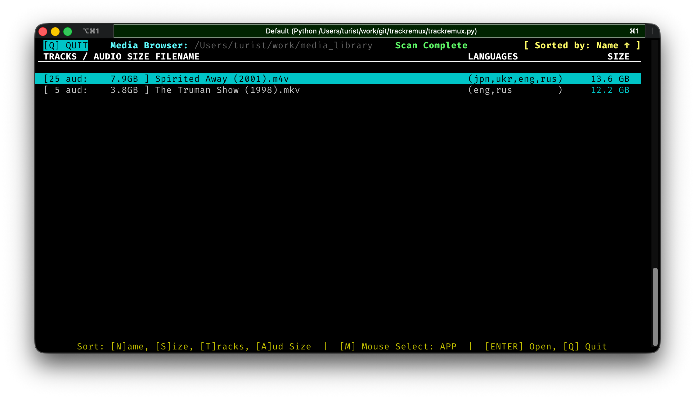
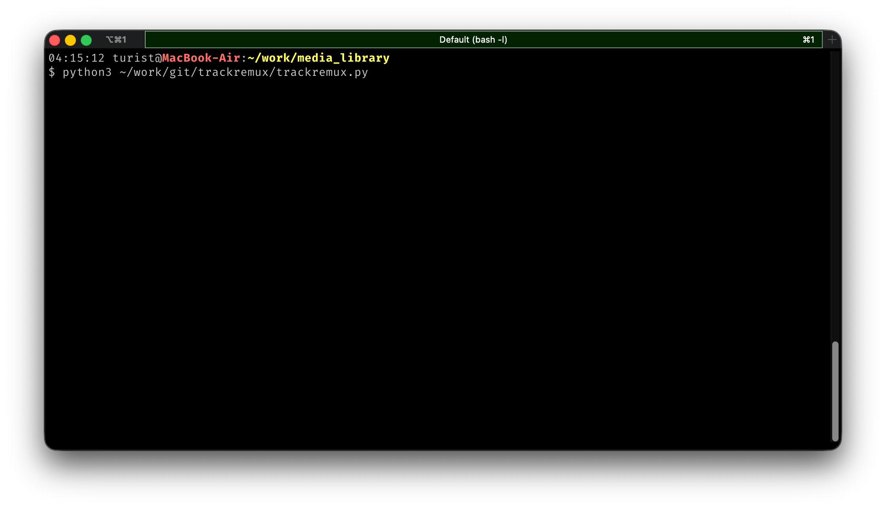
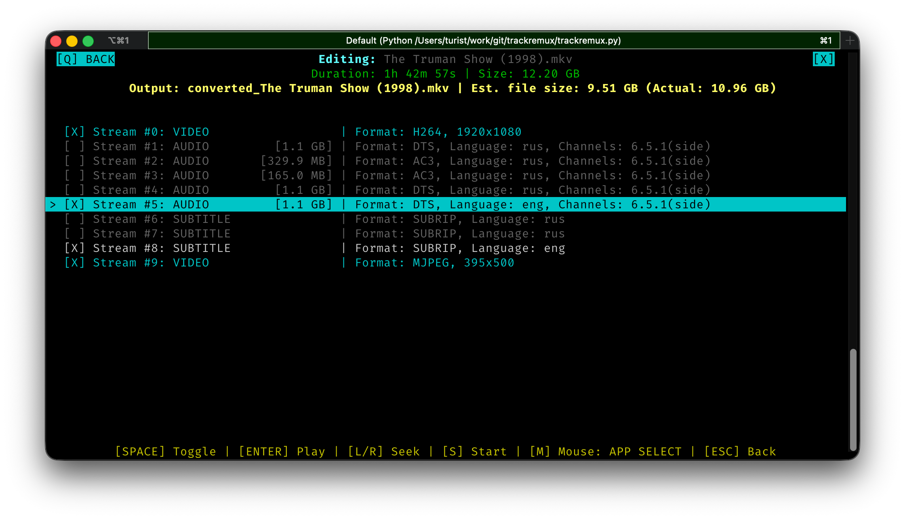
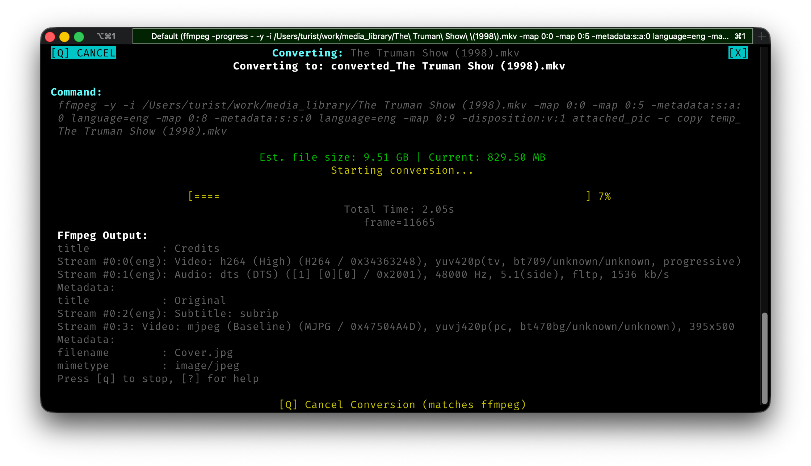
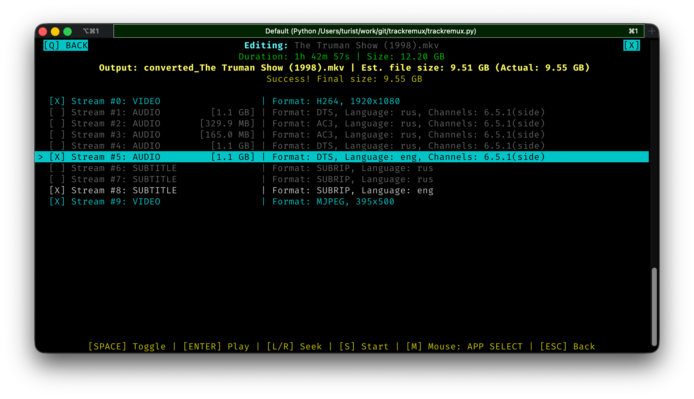
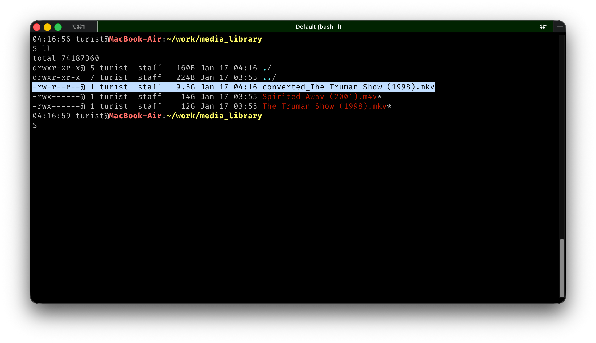

# TrackRemux

**TrackRemux** is a powerful Terminal User Interface (TUI) tool designed to help you clean up your video library. It allows you to interactively specify audio and subtitle tracks from your video files and remux them into clean, optimized containers without re-encoding the video stream.

*This whole project was vibe coded on a Friday evening out of necessity while organizing the media library on my NAS.*



## 🚀 Purpose

Modern media often comes with a bloat of unnecessary tracks—commentary audio, multiple languages you don't speak, or dozens of subtitle formats. **TrackRemux** simplifies the process of removing this clutter.

This not only saves significant disk space but also prevents the confusion and inconvenience of managing tracks in media players (like those on Smart TVs or mobile devices) where selecting the right audio or subtitle stream can be cumbersome or even impossible.

Instead of wrestling with complex `ffmpeg` command-line arguments for every single file, TrackRemux provides a visual interface to:
1.  **Scan** directories for video files.
2.  **Select** exactly which tracks you want to keep.
3.  **Remux** the file efficiently (Direct Stream Copy).

## ✨ Features

-   **Interactive TUI**: Built with `curses` for a fast, keyboard-centric workflow.
-   **Rich Meta-data Explorer**:
    -   Displays file sizes, track counts, and audio languages at a glance.
    -   **Visual Status Indicators**: Instantly spot files that have already been converted (Green size) or are currently processing (Dim Yellow).
-   **Deep Track Inspection**:
    -   View detailed info for every stream (Codec, Language, Bitrate, Channels).
    -   **Smart Matching**: Automatically detects existing conversions and restores your previous track selections.
-   **Preview Capabilities**: Listen to audio tracks directly from the TUI (macOS `afplay` integration) to confirm contents before keeping them.
-   **Safe Conversion**:
    -   Uses `ffmpeg` for robust processing.
    -   Non-destructive: Creates new files (`converted_filename`) by default.
    -   Real-time progress bar and size estimation.

## 📸 Visual Walkthrough

### 1. Launch & Directory Scan
Scan any folder to instantly see track counts and sizes.


### 2. Intelligent Track Selection
Pick exactly what you need. Audio previews help distinguish between different dubs or commentaries.


### 3. Fast, Lossless Conversion
Watch the progress in real-time as ffmpeg remuxes your file at disk-IO speeds.


### 4. Successful Completion
Final sizes and success messages are displayed directly in the TUI upon completion.


### 5. Efficient Storage
Remuxing is lossless and fast. You can see the significant size savings in your directory listing without any quality loss.


## 🛠️ Prerequisites

-   **Python 3.10+**
-   **FFmpeg** must be installed and accessible in your system PATH.
    -   macOS: `brew install ffmpeg`

## 📦 Installation & Setup

### Option 1: Install as a Global Tool (Recommended)
The easiest way to use TrackRemux is to install it globally using `uv`:
```bash
uv tool install trackremux
```
Once installed, you can simply run `trackremux` from any directory.

### Option 2: Running from Source
If you prefer to run it directly from the repository:

1.  **Clone the repository**:
    ```bash
    git clone https://github.com/antimirov/trackremux.git
    cd trackremux
    ```

2.  **Run using the wrapper**:
    ```bash
    python3 trackremux.py /path/to/media
    ```

3.  **Run as a module**:
    ```bash
    python3 -m trackremux /path/to/media
    ```

4.  **Using `uv` (for development)**:
    ```bash
    uv sync
    uv run trackremux /path/to/media
    ```

## 🖥️ Usage

You can point TrackRemux to a directory (Explorer Mode) or a specific video file (Editor Mode).

### Explorer Mode (Directory)
Browse and process your entire library:
```bash
trackremux /path/to/your/movies
```

### Single File Mode
Jump straight into the track editor for a specific file:
```bash
trackremux "My Movie.mkv"
```

---

## ⌨️ Keyboard Controls

### File Explorer
| Key | Action |
| :--- | :--- |
| **↑ / ↓** | Navigate file list |
| **PgUp / PgDn** | Scroll pages |
| **Enter** | Open selected file in Editor |
| **M** | Toggle Mouse Support |
| **Q** | Quit Application |
| **N / S / T / A** | Sort by **N**ame, **S**ize, **T**racks, **A**udio Size |

### Track Editor
| Key | Action |
| :--- | :--- |
| **Space** | Toggle Track (Keep/Discard) |
| **Enter** | Preview Track (Audio only) |
| **L/R Arrows**| Seek in preview |
| **↑ / ↓** | Navigate Tracks |
| **S** | **Start Conversion** / Save changes |
| **Esc** / **Q** | Back to Explorer |

## 🗺️ Roadmap
- [ ] **Batch Processing**: Select multiple files to queue for sequential remuxing.
- [ ] **Track Reordering**: Allow changing the order of audio and subtitle tracks in the final file.
- [ ] **Modern TUI**: Consider migrating to `Textual` for better UI/UX and cross-terminal compatibility.
- [ ] **Custom Rules**: Auto-selection of tracks based on preferred languages.

## 📝 License

MIT License. See `LICENSE` for more details.