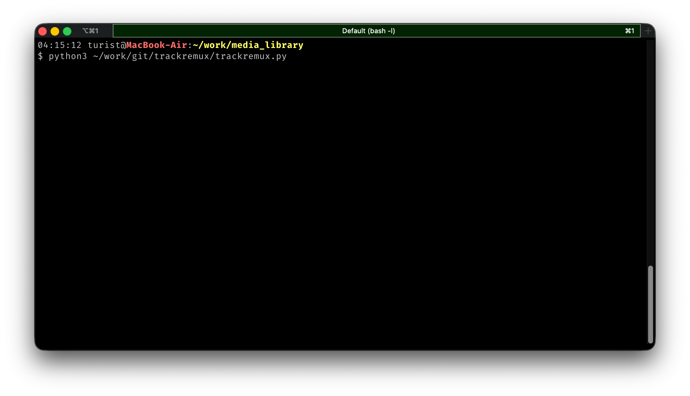
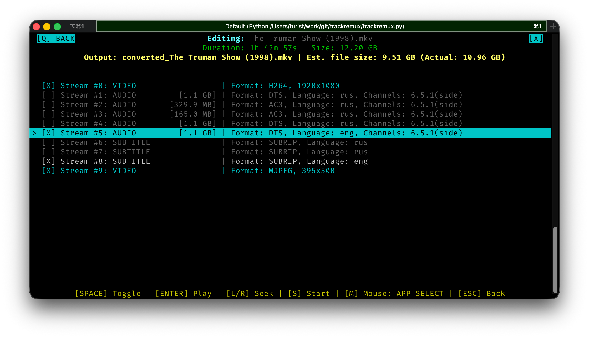
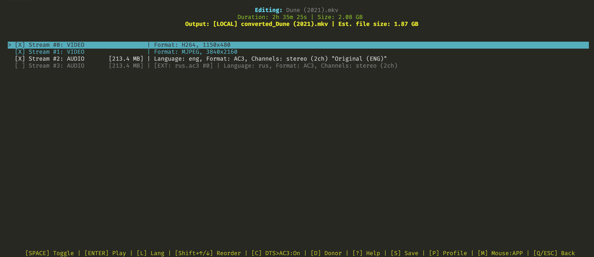
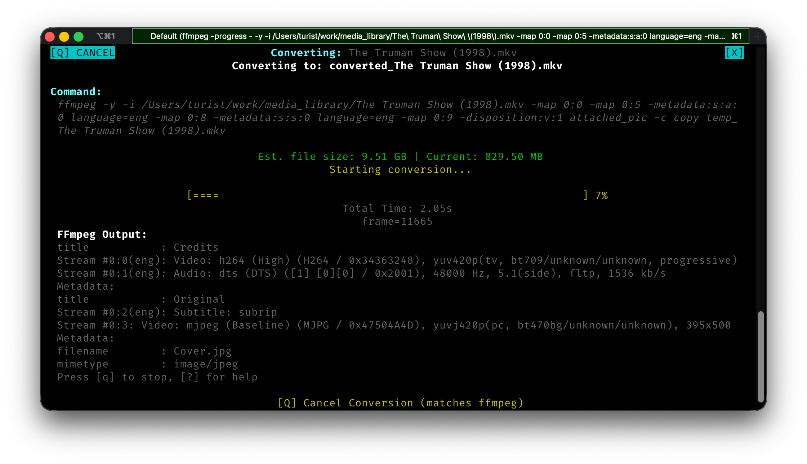
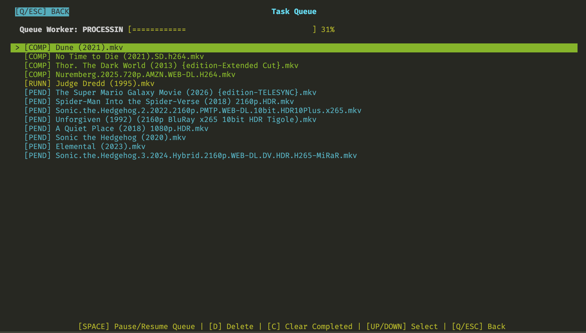
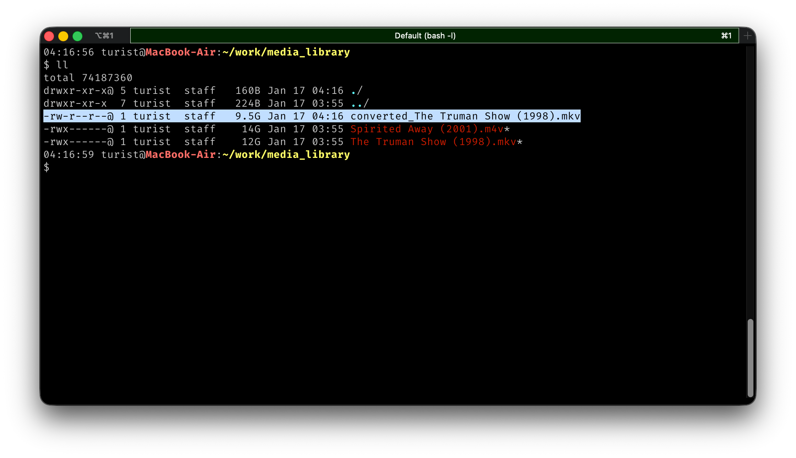

# TrackRemux

**TrackRemux** is a powerful Terminal User Interface (TUI) tool designed to help you clean up your video library. It allows you to interactively specify audio and subtitle tracks from your video files and remux them into clean, optimized containers without re-encoding the video stream.

*This whole project was vibe coded on a Friday evening out of necessity while organizing the media library on my NAS.*


> [!TIP]
> Check out the [CHANGELOG](CHANGELOG.md) to see what's new in the latest version!

## 🚀 Purpose

Modern media often comes with a bloat of unnecessary tracks - commentary audio, multiple languages you don't speak, or dozens of subtitle formats. **TrackRemux** simplifies the process of removing this clutter.


This not only saves significant disk space but also prevents the confusion and inconvenience of managing tracks in media players (like those on Smart TVs or mobile devices) where selecting the right audio or subtitle stream can be cumbersome or even impossible.

Instead of wrestling with complex `ffmpeg` command-line arguments for every single file, TrackRemux provides a visual interface to:
1.  **Scan** directories for video files.
2.  **Select** exactly which tracks you want to keep.
3.  **Remux** the file efficiently (Direct Stream Copy).

## ✨ Features

-   **Interactive TUI**: Built with `curses` for a fast, keyboard-centric workflow.
-   **Batch Processing**: Automatically detects and processes TV shows/series/collections sequentially.
    -   **Smart Detection**: Recognizes series patterns (S01E01, 1x01, Ep01) and groups by season.
    -   **Strict Structural Fingerprinting**: Safely groups files based on an identical layout of tracks, strictly enforcing matching track counts, languages, codecs, and channel layouts (e.g., separating WebDL AAC 2.0 files from Blu-Ray DTS-HD 5.1 files).
    -   **Unified Editing**: Edit one file, and automatically apply the same track selections and **logical reordering** (e.g., move Japanese audio to bottom) across the entire batch regardless of internal stream ID numbering.
    -   **Seamless Workflow**: Returning from a batch conversion automatically refreshes the selector view with updated metadata, allowing for a continuous "process next batch" rhythm.
-   **Rich Meta-data Explorer**:
    -   Displays file sizes, track counts, and audio languages at a glance.
    -   **Visual Status Indicators**: Instantly spot files that have already been converted (Green size) or are currently processing (Dim Yellow).
    -   **Folder Navigation**: Browse nested directory structures (`Enter` to open, `Esc` to go back).
-   **Deep Track Inspection**:
    -   **Track Reordering**: Move tracks up/down with `Shift+Arrow` keys to set their index in the final file.
    -   **External Tracks**: Automatically detects and integrates external audio/subtitle files (even in `Audio/` or `Subs/` subfolders).
    -   **Language Management**: Guesses 30+ language formats or supports manual setting via the `[L]` key.
    -   **Smart Language Inference**: Automatically recovers missing track languages from stream titles (e.g. "Russian") during scans—perfect for legacy AVI collections where language tags are often missing.
    -   **Metadata Persistence Bridge**: When you manually set a language for an AVI track, it's also saved into the stream title, ensuring the setting "sticks" and survives re-probes.
    -   **Donor Audio Track Import**: Press `[D]` to import fully synced, dubbed audio tracks directly from alternative movie releases sitting elsewhere in your library (Hybrid Remuxing). Built-in bulk `ebur128` deep analysis computes sub-millisecond sync offsets instantly without guesswork.
-   **Intelligent Output Management**:
    -   **Three Output Modes**: Choose between `[O]verwrite` (atomic in-place replacement), `[L]`ocal (save `converted_*` to CWD), or `[R]`emote (save `converted_*` next to source files).
    -   **Smart Batch Output**: Batch conversions automatically create a `converted_<directory>/` folder with original filenames preserved, instead of prefixing every file.
    -   **NAS-Safe Atomic Swaps**: Overwrites are safely processed in a hidden `.trackremux_staging/` directory and shifted via instantaneous atomic swaps to avoid media server race conditions, keeping original files safely in `.trackremux_trash/` for recovery.
    -   **Read-Only Detection**: Automatically warns when the source filesystem is read-only, preventing failed Overwrite/Remote saves.
-   **Intelligent HD Audio Fallbacks (THD/DTS → EAC3/AC3)**:
    -   Automatically transcode high-bitrate incompatible formats (DTS-HD MA, TrueHD, DTS) down to universally compatible `EAC3 5.1` (1024kbps) or `AC3 640k` via the `[C]` hotkey.
    -   Features a robust encoding safety net: if your version of `ffmpeg` encounters layout limitations (e.g. failing to encode 7.1 to EAC3), it automatically catches the failure and falls back to the next-best conversion format without breaking the batch.
    -   Features dynamic `THD`, `DTS`, or `PCM` badges directly inside the Explorer file list, including `DTS>AC3` etc. tracking conditionally encoded streams.
    -   Added `[D]` hotkey to explicitly filter media list views exclusively to files with high-definition audio formats (TrueHD, DTS, PCM).
-   **Smart Configurations & Profiles**:
    -   Build and utilize default setting profiles (`keep_langs`, `discard_langs`, `ac3` preference overrides).
    -   Interactive profile editor overlay via `[P]` — Enter to edit fields, cursor navigation, Enter to confirm and auto-save, Escape to discard changes.
    -   Profiles can be intelligently evaluated and interactively applied with `[A]` across matches to dramatically accelerate repetitive multi-file adjustments.
-   **Safe Conversion**:
    -   Uses `ffmpeg` for robust processing.
    -   Identifies edited assets automatically tracking changes reliably even across format shifts with its own `.mkv` metadata tag system: `trackremux_id`.
    -   Real-time accurate progress tracking based on frame ratios rather than arbitrary byte streams, complete with dynamically recalculated size reduction estimates during audio transcoding.

## 📸 Visual Walkthrough

### 1. Launch & Directory Scan
Scan any folder to instantly see track counts and sizes.


### 2. Intelligent Track Selection
Pick exactly what you need. Audio previews help distinguish between different dubs or commentaries.


### 3. External Tracks & Language Editing
TrackRemux finds external subtitle/audio files automatically. You can also manually correct missing language tags.


### 4. Fast, Lossless Conversion
Watch the progress in real-time as ffmpeg remuxes your file at disk-IO speeds.


### 5. Background Task Queue
Press `[S]ave` to instantly queue files. The background worker remuxes them sequentially while you continue browsing and queuing more content. Press `[V]` to monitor the queue and view detailed stats for each task. The queue is fully **multi-instance safe** and supports auto-recovery—if your SSH session drops or your Mac restarts, simply open TrackRemux again and it will instantly adopt and resume any abandoned tasks.


### 6. Successful Completion
Final sizes and success messages are displayed directly in the TUI upon completion.


### 7. Efficient Storage
Remuxing is lossless and fast. You can see the significant size savings in your directory listing without any quality loss.


## 🛠️ Prerequisites

-   **Python 3.10+**
-   **FFmpeg** must be installed and accessible in your system PATH.
    -   macOS: `brew install ffmpeg`

## 📦 Installation & Setup

### Option 1: Install as a Global Tool (Recommended)
The easiest way to use TrackRemux is to install it globally using `uv`:
```bash
uv tool install trackremux
```
Once installed, you can simply run `trackremux` from any directory.

### Option 2: Running from Source
If you prefer to run it directly from the repository:

1.  **Clone the repository**:
    ```bash
    git clone https://github.com/antimirov/trackremux.git
    cd trackremux
    ```

2.  **Run using the wrapper**:
    ```bash
    python3 trackremux.py /path/to/media
    ```

3.  **Run as a module**:
    ```bash
    python3 -m trackremux /path/to/media
    ```

4.  **Using `uv` (for development)**:
    ```bash
    uv sync
    uv run trackremux /path/to/media
    ```

## 🖥️ Usage

You can point TrackRemux to a directory (Explorer Mode) or a specific video file (Editor Mode).

### Explorer Mode (Directory)
Browse and process your entire library:
```bash
trackremux /path/to/your/movies
```

### Single File Mode
Jump straight into the track editor for a specific file:
```bash
trackremux "My Movie.mkv"
```

---

## ⌨️ Keyboard Controls

### File Explorer
| Key | Action |
| :--- | :--- |
| **↑ / ↓** | Navigate file list |
| **PgUp / PgDn** | Scroll pages |
| **Enter** | Open selected file in Editor |
| **B** | Open Batch Selector (when batches detected) |
| **D** | Toggle Filter: All / HD Audio only |
| **M** | Toggle Mouse Support |
| **V** | Open Background Task Queue |
| **R** | Force re-scan current directory |
| **N / S / T / A** | Sort by **N**ame, **S**ize, **T**racks, **A**udio Size |
| **Q / Esc** | Quit Application |
| **Ctrl+C** | Force Quit instantly |

### Track Editor
| Key | Action |
| :--- | :--- |
| **Space** | Toggle Track (Keep/Discard) |
| **Enter** | Preview Track (Audio only) |
| **← / →** | Seek in preview |
| **↑ / ↓** | Navigate Tracks |
| **Shift+↑ / ↓** | Move selected track UP / DOWN |
| **L** | Set Language (manual edit) |
| **C** | Toggle HD Audio conditioning (THD/DTS → EAC3/AC3) |
| **P** | Open Profile editor (keep/discard languages, AC3 preference) |
| **A** | Apply saved profile to current file |
| **M** | Toggle Mouse Support |
| **S** | Save — Select output mode ([O]verwrite / [L]ocal / [R]emote) and enqueue |
| **Esc / Q** | Back to Explorer |

## 🗺️ Roadmap

See [ROADMAP.md](ROADMAP.md) for the full feature roadmap. Highlights:

- ✅ **Batch Processing** — Completed in v0.6.0
- ✅ **In-Place Saving** — Overwrite / Local / Remote output modes — Completed in v0.7.0
- ✅ **Audio Conditioning** — Flatten DTS-HD / TrueHD to AC3 for universal playback — Completed in v0.7.0
- ✅ **Smart Defaults** — Auto-select tracks based on language config profiles — Completed in v0.7.0
- ✅ **Hybrid Remuxing** — Donor Track Import with automatic `ebur128` sync detection — Completed in v0.9.0
- ⚡ **Track Metadata** — Edit titles, set default/forced disposition flags
- 🔤 **Subtitle Sync** — Shift subtitle tracks ±N ms directly in the TUI before muxing
- 🏥 **Library Health Checks** — Detect corrupted bitstreams across large libraries
- 🧊 **Dry Run / Export** — Generate `.sh` scripts for remote NAS execution

## 📝 License

MIT License. See [LICENSE](LICENSE) for more details.